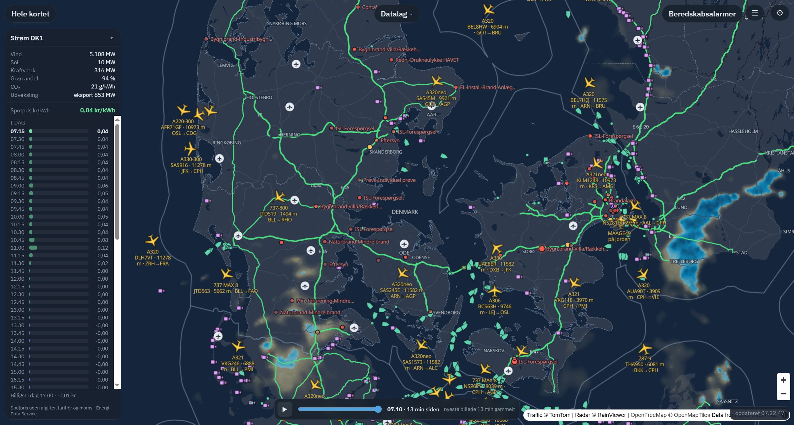
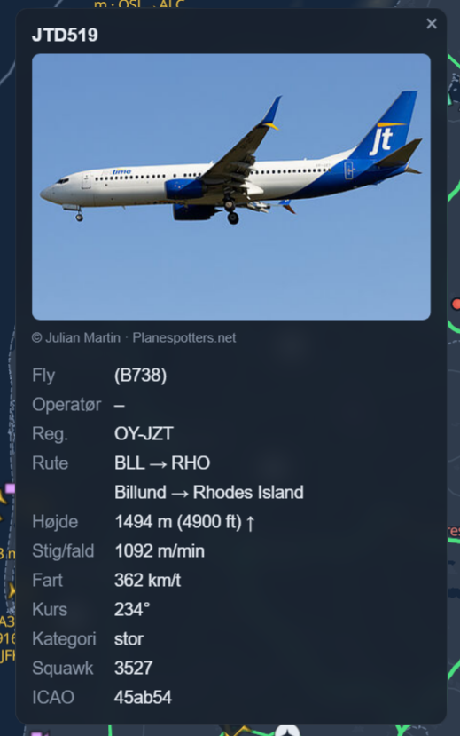
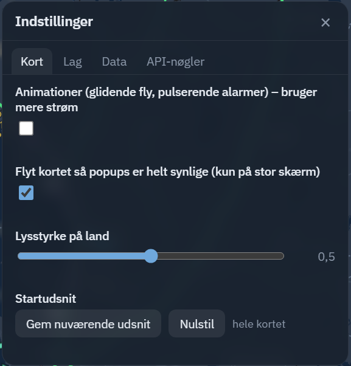
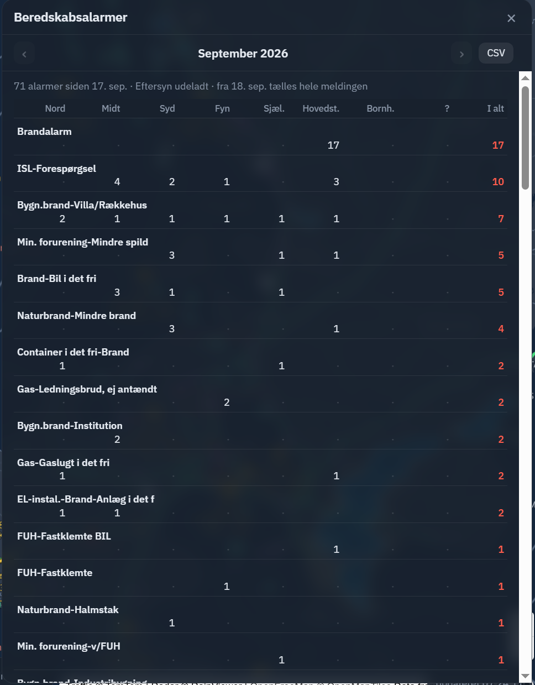

# DK live

Live kort over Danmark og Nordtyskland med offentlige datakilder samlet ét sted: fly, skibe,
112-alarmer, trafik, vejarbejde, regnradar, webcams, lufthavne og elpriser.

Kører som en lille Node-server på dit eget netværk. Ingen data forlader maskinen ud over kaldene
til de offentlige API'er, og de fleste lag virker helt uden nøgler.



---

## Indhold

- [Hvad kan det](#hvad-kan-det)
- [Datalag](#datalag)
- [Installation](#installation)
  - [På en pc (hurtigt)](#på-en-pc-hurtigt)
  - [I Docker / Proxmox](#i-docker--proxmox)
- [Miljøvariabler](#miljøvariabler)
- [API-nøgler](#api-nøgler)
- [Indstillinger](#indstillinger)
- [Administration](#administration)
- [Opdatering](#opdatering)
- [Fejlfinding](#fejlfinding)
- [Kilder og vilkår](#kilder-og-vilkår)

---

## Hvad kan det

- **Fly** i realtid med flytype, rute, højde og et foto af netop det fly
- **Skibe** via AIS med status, størrelse, dybgang, destination og ETA
- **112-alarmer** fra ODIN placeret ved den udrykkende brandstation, med statistik pr. måned
- **Trafik**: hændelser fra Vejdirektoratet, tysk Autobahn, og farvelagte motorveje efter
  hastighed (grøn/gul/rød) som på Google Maps
- **Vejr**: regnradar med afspilning af de sidste 2 timer plus 30 minutters prognose, og klik hvor som helst på kortet for en punktprognose
- **Lufthavne** med baner, frekvenser, live METAR og hvilke fly der står på jorden eller er på vej
- **Elpriser** for DK1/DK2 kvarter for kvarter samt produktionsmix og CO₂ lige nu
- **Webcams** fra tyske motorveje, Windy og din egen liste



## Datalag

| Lag | Kilde | Nøgle | Bemærkning |
| --- | --- | --- | --- |
| Fly / Militærfly | adsb.lol | nej | Opdateres hvert 15. sek., bevæges jævnt imellem opslag |
| Ruter og fotos | adsbdb + Planespotters | nej* | *Planespotters kræver en kontaktadresse i indstillingerne |
| Skibe | AISStream | gratis | Websocket, holdes åben af serveren |
| Lufthavne | OurAirports + aviationweather.gov | nej | Data hentes én gang og caches i 30 dage |
| 112-alarmer | odin.dk/112puls via beredskabsinfo.dk | nej | Position = brandstation, ikke hændelsen |
| Trafik (DK) | Vejdirektoratet | nej | Kun statsveje |
| Autobahn (DE) | Autobahn GmbH | nej | 14 motorveje i Slesvig-Holsten og Hamborg |
| Trafiktæthed | TomTom Traffic Flow | gratis | 2.500 kald/døgn på gratisniveauet |
| Regnradar | RainViewer | nej | 2 timer bagud, 30 min. prognose |
| Vejrudsigt | Open-Meteo | nej | Knappen **Vejr** viser udsigten for kortets midte; vælg et andet sted med "Vælg et andet sted": nu, nedbør pr. kvarter i 6 timer, time for time i 2 dage, 3 døgn |
| Lyn | DMI lightningdata | nej | Nedslag den seneste time. API'et er åbent siden 2026; nøgle er valgfri |
| Tog | Rejseplanen API 2.0 | gratis | Ikke-kommerciel brug, 50.000 kald/md. |
| Webcams | Autobahn + Windy + egen liste | gratis* | *Windy kræver nøgle; de tyske er fri |
| Politi | Politi Update via Via Ritzau (RSS) | nej | Knappen **Politi**: sager fra alle 12 kredse de sidste 7 dage, fold ud for hele forløbet |
| Strøm DK1/DK2 | Energi Data Service | nej | Produktion, CO₂, spotpris |

---

## Installation

Kræver **Node.js 20 eller nyere** (pc) eller **Docker** (server).

### På en pc (hurtigt)

```powershell
git clone https://github.com/slqdk/dk-live.git
cd dk-live
npm install
copy .env.example .env
npm run dev
```

Åbn <http://127.0.0.1:4200>.

### I Docker / Proxmox

Anbefalet til daglig drift: kører videre efter genstart og kan nås fra telefonen.

**1. Opret en LXC-container** i Proxmox: Debian 12, 1 kerne, 512 MB RAM, 8 GB disk, statisk IP.
Under **Options → Features** skal **Nesting** slås til (Docker kræver det) — genstart containeren
bagefter.

**2. Installér Docker og hent koden:**

```bash
apt update && apt install -y ca-certificates curl git
curl -fsSL https://get.docker.com | sh
cd /opt && git clone https://github.com/slqdk/dk-live.git && cd dk-live
```

**3. Tilpas `compose.yml`** — især `SETTINGS_ALLOW`, som er de netværk der må se og ændre
indstillinger:

```yaml
      SETTINGS_ALLOW: 30.11.0.0/20,10.0.0.0/20
```

**4. Start:**

```bash
chmod +x update.sh
docker compose up -d --build
docker compose logs -f
```

Åbn `http://<container-ip>:4200`.

**5. Automatisk start:** i Proxmox under **Options → Start at boot**. Selve appen har
`restart: unless-stopped` og kommer op sammen med containeren.

**6. Et pænt navn:** lav en DNS-rewrite i AdGuard Home (eller din router) fra `dklive.lan` til
containerens IP. På telefonen: åbn siden og vælg *Føj til startskærm*.

---

## Miljøvariabler

Alt kan sættes i `.env` (pc) eller under `environment:` i `compose.yml` (Docker). Ingen af dem er
påkrævede.

| Variabel | Standard | Betydning |
| --- | --- | --- |
| `PORT` | `4200` | Port serveren lytter på |
| `HOST` | `0.0.0.0` | `127.0.0.1` for kun denne maskine |
| `SETTINGS_ALLOW` | tom | Netværk (CIDR, kommasepareret) der må se ⚙ og log. Loopback er altid tilladt |
| `FLIGHTS_POLL` | `15` | Sekunder mellem opslag hos adsb.lol |
| `ODIN_POLL` | `90` | Sekunder mellem 112-opslag |
| `TRAFFIC_POLL` | `180` | Vejdirektoratet |
| `AUTOBAHN_POLL` | `300` | Autobahn GmbH |
| `TRAINS_POLL` | `60` | Rejseplanen |
| `ENERGY_POLL` | `120` | Energi Data Service |
| `AISSTREAM_API_KEY` | tom | Kan også sættes i appen |
| `TOMTOM_API_KEY` | tom | — |
| `WINDY_API_KEY` | tom | — |
| `REJSEPLANEN_API_KEY` | tom | — |
| `DMI_LIGHTNING_KEY` | tom | — |

Kortets udsnit (Danmark + Nordtyskland) står i `server/bbox.js` og `public/app.js` — ret begge
steder, hvis du vil dække et andet område.

## API-nøgler

Alle nøgler er gratis og til privat brug. De gemmes på serveren i `server/cache/settings.json`
(kun læsbar af ejeren) og kommer aldrig ud i browseren.

| Tjeneste | Hvor | Giver |
| --- | --- | --- |
| AISStream | <https://aisstream.io> | Skibe |
| TomTom | <https://developer.tomtom.com> | Trafiktæthed |
| Windy | <https://api.windy.com/keys> | Webcams i Danmark |
| Rejseplanen | <https://labs.rejseplanen.dk> | Tog |
| DMI | <https://opendatadocs.dmi.govcloud.dk> | Lyn (valgfri – API'et er åbent) |

Indsæt dem i appen under **⚙ → API-nøgler**. Laget starter med det samme — ingen genstart.

Under **⚙ → Data → Kontakt** skal du skrive en mail eller URL. Planespotters kræver en
kontaktadresse i User-Agent, ellers vises der ingen flyfotos.

## Indstillinger



**⚙** åbner fire faner. Alt gemmes på serveren og gælder **alle enheder** — også hvilke lag der er
tændt. Knappen findes kun på adresser i `SETTINGS_ALLOW`.

- **Kort** — lysstyrke på land, om kortet må flytte sig for popups, animationer (koster batteri på
  telefonen), og "gem nuværende udsnit" som startvisning
- **Lag** — ikonstørrelser, linjebredde på trafiktæthed, radarens gennemsigtighed, tekstlængde,
  zoomniveau for flynavne
- **Data** — poll-intervaller, elområde (DK1/DK2), timepriser i stedet for kvarter, hvor mange
  sider 112-alarmer der hentes, og hvilke alarmkategorier statistikken skal se bort fra
- **API-nøgler** — som ovenfor

## Administration

**☰** ved siden af ⚙ (også kun fra hjemmenetværket) viser:

- **Serverlog** — alt hvad serveren skriver, live, uden at skulle ind i en terminal
- **Besøgende** — hver IP der har været forbi: enhed, sidevisninger, antal kald, først og sidst set,
  grøn prik hvis de er aktive nu

**Beredskabsalarmer** (knappen øverst til højre) viser statistik måned for måned fordelt på
landsdele, og de seneste alarmer nedenunder. Data gemmes i `server/cache/alarm-log.json` fra den
dag du starter serveren — tidligere alarmer kan ikke hentes, da kilden kun viser de seneste.
Knappen **CSV** henter måneden som regneark.



## Opdatering

**På pc'en:** kør `push.bat`, skriv hvad du har ændret. Den committer og sender til GitHub.

**På serveren:**

```bash
cd /opt/dk-live && ./update.sh
```

Henter, bygger og genstarter. Nøgler, indstillinger og alarmlog ligger i Docker-volumet
`dk-live-cache` og overlever både opdatering og genstart.

Rul tilbage til en tidligere version:

```bash
git checkout v1.0 && docker compose up -d --build
```

## Fejlfinding

| Symptom | Årsag / løsning |
| --- | --- |
| `./update.sh: Permission denied` | `chmod +x update.sh` |
| Docker vil ikke starte i containeren | **Nesting** er ikke slået til i Proxmox — slå til, og genstart containeren |
| Alt viser `failed: ENOTFOUND` | DNS i containeren. Tjek `cat /etc/resolv.conf` |
| Fly: `HTTP 429` | adsb.lol begrænser. Sæt ⚙ → Data → "Fly – hent hvert" til 20 s |
| Ingen flyfotos | ⚙ → Data → Kontakt er tom |
| Ingen skibe | AISStream-nøgle mangler, eller laget er slået fra |
| Trafiktæthed er grå | TomTom-nøglen mangler, eller kvoten for i dag er brugt. Tjek loggen (☰) |
| ⚙ mangler | Din adresse er ikke i `SETTINGS_ALLOW` — sådan skal det være udefra |
| Telefonen bliver varm | Slå **Animationer** fra under ⚙ → Kort |
| 112-statistikken er tom | Der logges først fra den dag serveren kørte med funktionen |
| Vil nulstille statistikken | Slet `server/cache/alarm-log.json` og genstart |
| Vil nulstille alt | `docker compose down -v` og start igen (sletter også nøgler) |

**Status på alle kilder:** `http://<adresse>:4200/api/health`
**Log:** `docker compose logs -f --tail 100` eller ☰ i appen

## Kilder og vilkår

Data leveres af og tilhører deres respektive udbydere. Vis altid kildeangivelsen der hvor den
kræves — appen gør det allerede i popups og i kortets hjørne.

- 112-alarmer: **Kilde: www.odin.dk/112puls** (Beredskabsstyrelsen), hentet via beredskabsinfo.dk
- Trafik: Vejdirektoratet · Autobahn GmbH des Bundes (bund.dev)
- Trafiktæthed: © TomTom — gratisniveauet er til ikke-kommerciel brug
- Regnradar: © RainViewer
- Punktprognose: Open-Meteo.com (CC BY 4.0), baseret på DWD ICON, ECMWF, DMI m.fl.
- Webcams: Autobahn GmbH · *webcams by Windy* · egne kilder
- Fly: adsb.lol · adsbdb · fotos fra Planespotters.net med fotografens navn
- Skibe: AISStream · skibsfotos fra Wikimedia Commons
- Lufthavne: OurAirports (public domain) · METAR fra aviationweather.gov (NOAA)
- Politi: Politi Update fra politikredsene, distribueret af Via Ritzau
- Strøm: Energi Data Service (Energinet)
- Kort: OpenFreeMap · © OpenMapTiles · © OpenStreetMap-bidragydere
- Geokodning: Nominatim / Overpass (OpenStreetMap)

Data er forsinkede og til orientering. Brug dem ikke til navigation, beredskab eller andet
operationelt.

## Licens

MIT — se [LICENSE](LICENSE).
